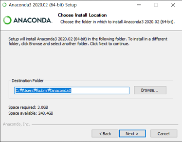

# Install python with Anaconda🐍

#### What is Anaconda?

아나콘다(Anaconda)는 패키지 관리와 배포를 단순케 할 목적으로 만든 자유-오픈 소스 배포판입니다. 아나콘다를 설치하면 Python 뿐만 아니라 data science, mathematics 등등에 필요한 여러 package들도 같이 설치되어 사용에 용이하다는 점이 있습니다. (Jupyter notebook 또한 같이 설치됩니다.)

#### How to install Anaconda?

인터넷에는 좋은 자료들이 많습니다. 해당 영상은 어떻게 Anaconda를 설치하는지 잘 알려주고 있으니, 참고하여주시길 바랍니다.

[Windows10 Anaconda Installation Guide/How to install Anaconda in Windows10](https://www.youtube.com/embed/TiYbde4YTPY?t=0s)

#### Tip

가끔, 설치하는 경로에 한국어가 포함되어 있으면 설치가 되지 않으니 설치하는 경로에 한국어가 포함되어 있지 않은지 확인해 주세요. (ex C:\User\홍길동\anaconda3 💀)

---

[Go - How to use Jupyter Notebook](How-to-use-Jupyter-Notebook.md)