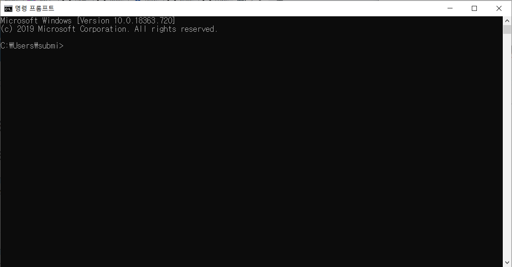
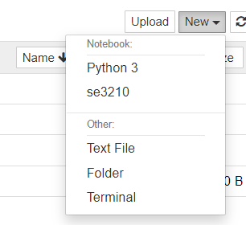
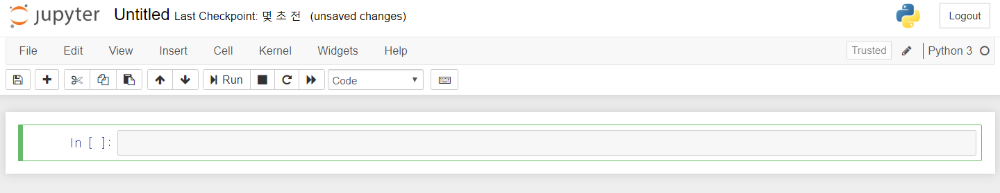
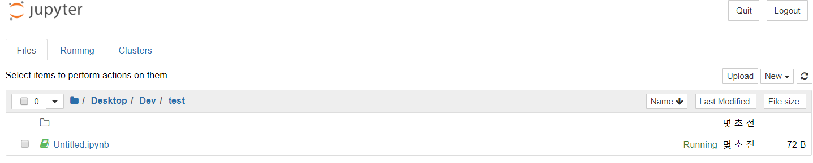

# How to use Jupyter Notebook🤔

#### Launching Jupyter Notebook

아나콘다를 설치하셨다면, Win + S를 누르고 난 뒤, cmd를 검색하도록 합시다. 



그럼 위와 같은 terminal 창이 열릴 것입니다. 여기서 다음의 명령어를 쳐주세요.

```
jupyter notebook
```

그러면 브라우저에서 자동으로 다음과 같은 사이트를 띄워줄 것입니다.


> Caution😱
>
> Terminal을 통해 Jupyter notebook을 열었다고 해서 Terminal을 닫으면 안됩니다!  Terminal을 닫으면 정상적인 Jupyter notebook을 사용할 수 없습니다!


#### Create Jupyter Notebook

이제 거의 다 왔습니다. 자신이 개발하고자 하는 작업 위치에 간 후 우측 상단에 있는 New 버튼을 누르시면 다음과 같은 리스트들이 보여집니다. 여기서, Python 3를 클릭하시면 jupyter Notebook을 생성할 수 있습니다.



> Tip
>
> 만약 바탕화면에다 새로운 Jupter Notebook을 생성하고 싶다면 /Desktop 에서 New 버튼을 클릭하시면 됩니다. 


#### Basic use of Jupyter Notebook

New에서 Python 3를 선택하여 Jupyter Notebook을 생성하셨다면 다음과 같을 것입니다.



생성된 파일 확장자 명을 보면 다음과 같습니다.



확장자 명을 보면 `.ipynb` 으로 되어 있음을 알 수 있습니다. 다시 돌아와서, 간단한 설명을 보태자면 다음과 같습니다.


이렇게 보이는 것을 cell이라고 부르며, 코드를 작성할 수 있는 공간입니다. 


python의 기본 출력 함수 print를 사용하여 실행(Run)을 하면 다음과 같이 결과가 cell 밑에 나타나게 됩니다.

이로서 아주 기본적인 Jupyter notebook 생성 방법과 python을 실행 방법을 익혔습니다. 이 외에 좀더 자세한 사용방법은 [여기](http://bitly.kr/0tmjqtNt)에서 확인 할 수 있습니다.