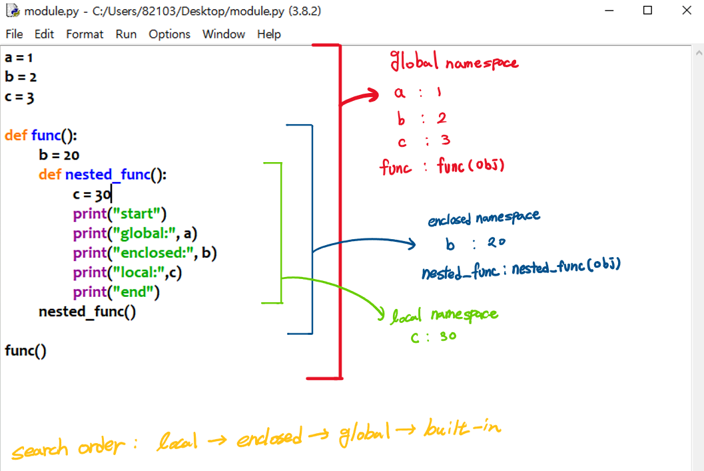

# Scope & Namespace

이번에는 `Scope`와 `Namespace`에 관하여 알아보도록 하겠습니다. 일단 이 둘의 정의를 살펴보고 각각을 설명하도록 하겠습니다.

- [Namespace](#Namespace)

  A *namespace* is a mapping from names to objects.

- [Scope](#Scope)

  A *scope* is a textual region of a Python program where a namespace is directly accessible.

## Namespace

`Namespace`를 간단히 표현하자면, 이름과 객체 쌍들의 집합이라고 보시면 됩니다. Python에서는 이를 `dict`의 형태로 저장하고 있습니다.  `dict`의 특징은 key와 value가 쌍으로 이룬 구조라고 했습니다. 그렇기 때문에 한 `namespace`에서 이름이 겹치는 경우는 없어야합니다. 

그런데 `namespace`가 꼭 하나만 존재하는 것은 아닙니다. 다음과 같이 여러 종류의 `namespace`가 존재합니다.

- Built-in Namespace

  이미 python에서 구현되어 있는 *namespace*입니다. 예를 들어, `print()`의 경우에 여러분들이 직접 코딩한 적은 없지만 사용은 할 수 있습니다. 이러한 경우 이미 Built-in Namespace에 존재하기 때문에 사용가능한 것입니다. 이는 프로그램이 종료되더라도 namespace가 사라지지 않습니다.

- Global Namespace

  Module에서 정의된 함수나 변수를 저장하기 위한 *namespace*입니다. 흔히, 코딩을 할 때 정의되는 변수와 함수는 여기에 저장됩니다. 해당 *namespace*는 프로그램이 종료되면 사라집니다.

- Enclosed Namespace

  Nested function일때 생기는 *namespace*로써(함수 안에 함수를 새롭게 정의한 경우) function이 종료되면 사라집니다.

- Local Namespace

  Function 혹은 method 내에서 정의된 함수나 변수를 저장하기 위한 *namespace*입니다. 이는 fucntion, method를 만들때 마다 새로운 local namespace가 생성됩니다. function이 종료되면 사라집니다.

## Scope

`Scope`도 간단히 말하면 `namespace`에 접근할 수 있는 영역의 범위를 뜻합니다.  `Scope`또한 namespace와 같은 종류로 존재합니다.

- Built-in scope

  print, input과 같은 기본적인 함수들은 어느 python 파일에서든지 함수를 정의하지 않고 그냥 사용할 수 있습니다. Built-in scope의 경우에는 모든 python 영역에서 참조할 수 있습니다.

- Global scope

  한 파일(.py, .ipynb) 내에서 정의되는 영역을 뜻합니다.

- Enclosed scope

  nested function을 포함한 function의 code block 내 영역을 뜻합니다.

- Local scope

  function의 code block 내 영역을 뜻합니다.

사진으로 설명을 덧붙이자면 다음과 같습니다.



색깔별로 namespace에 접근 가능한 영역(scope)를 표시하였습니다. 또한 해당 namespace에 어떤 이름과 객체가 저장되어 있는지 적어두었습니다.

```python
# 출력 결과
start
global: 1
enclosed: 20
local: 30
end
```

마지막에 `search order`을 보시면 local, enclosed, global, built-in 순으로 탐색하게 됩니다. a의 경우를 보시면, local namespace에는 c 밖에 없음으로 다음 namespace인 enclosed로 옮겨서 탐색하지만 b 밖에 없기 때문에 global namespace로 까지 옮겨저서 해당 namespace에 있는 a : 1을 찾아 내어 출력되게 됩니다. 이와 같은 흐름으로 b,c,`print()`가 각각 어디서 참조되어 불리는지 알 수 있을 것입니다.

---

[Go - Object Oriented Programming](./Object-Oriented-Programming.md)